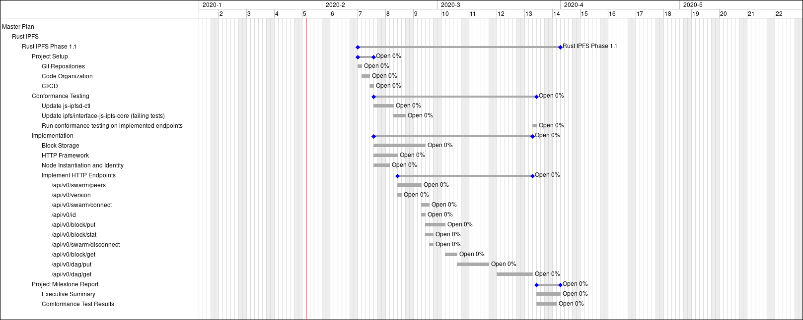
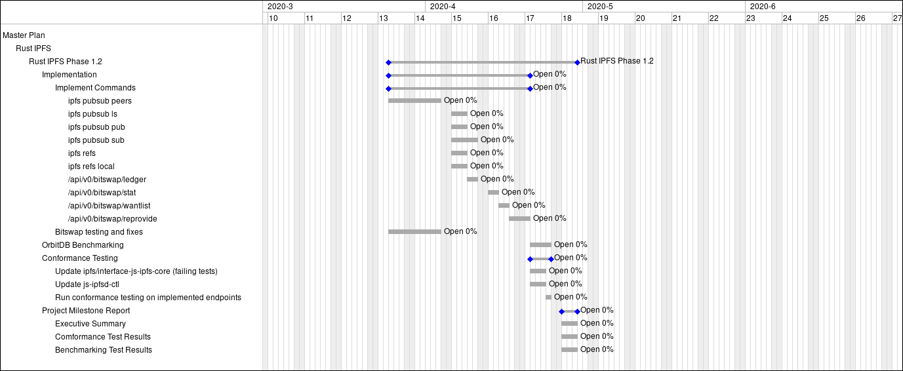
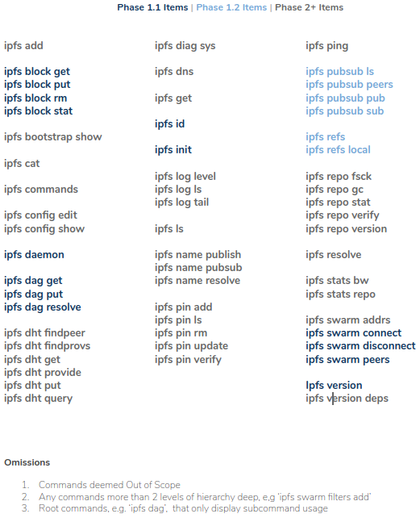

# Open Grant Proposal: Rust IPFS
> Category: core-dev | Proposed by: Mark Henderson (MRH.io), Joonas Koivunen (Equilibrium Labs)

Rust, the programming language, has enjoyed a recent spike in popularity. This is due both to
its inclusive community, and also being a safe systems language with performance comparable to
C and C++. An IPFS implementation written in Rust only makes sense.

The IPFS community agrees, and since then has created an astonishing amount of output.
David Craven’s “rust-ipfs”, the work of the multiformats team, and of course Parity’s rust-libp2p. Our aim is to build upon this work, forking only when necessary, and carry the torch across the finish line.

If funded, the IPFS implementation detailed in this proposal would be a properly stewarded Rust
codebase that could stand alongside its Go and JS siblings, and be used successfully in a
variety of contexts: either as a “crate,” a command line interface, or via its familiar HTTP API.

At the very least, we hope that our effort in scoping and planning is useful to any others who
might want to continue - and hopefully complete - this work.

_We agree to license past and future contributions of this proposal under the dual
MIT/Apache-2.0 license, allowing licensees to choose either at their option._

## Table of Contents

* [Project Description](#project-description)
    * [Summary](#summary)
    * [Value](#value)
    * [Survey of Community Efforts](#survey-of-community-efforts)
    * [Maintenance and Upgrade Plan](#maintenance-and-upgrade-plan)
    * [Figure 1. Risk Assessment](#figure-1-risk-assessment)
    * [Project Team](#project-team)
* [Project Plan](#project-plan)
    * [Summary](#summary)
    * [Implementation Details](#implementation-details)
        * [IPLD](#ipld)
        * [libp2p](#libp2p)
    * [Metric: Number of HTTP Endpoints Implemented](#metric-number-of-http-endpoints-implemented)
    * [Definition of Done](#definition-of-done)
    * [Out of Scope](#out-of-scope)
    * [Phase 1.1 IPLD Foundations](#phase-11-ipld-foundations)
        * [Deliverables](#deliverables)
        * [Development Schedule](#development-schedule)
            * [Figure 2: Phase 1.1 Gantt Chart](#figure-2-phase-11-gantt-chart)
        * [Estimated Budget (Phase 1.1)](#estimated-budget-phase-11)
    * [Phase 1.2: IPLD Application Support](#phase-12-ipld-application-support)
        * [Deliverables](#deliverables-1)
        * [Development Schedule](#development-schedule-1)
            * [Figure 3: Phase 1.2 Gantt Chart](#figure-3-phase-12-gantt-chart)
        * [Estimated Budget (Phase 1.2)](#estimated-budget-phase-12)
    * [Phase 2 and Onward](#phase-2-and-onward)
    * [Figure 4: Implementation Schedule](#figure-4-implementation-schedule)

## Project Description

### Summary

The following proposal details our project plan for the delivery of Rust IPFS. In deciding
which pieces of IPFS functionality to tackle first, we focused on a pair of end use cases:

1. Applications that leverage IPLD, such as OrbitDB and other types of event sourcing
2. Gateway nodes, which enrich the network by making public content more accessible

In preparation for this, the team researched the existing community contributions and, by
way of a diligent gap analysis, have charted out the path to delivery. During execution,
the team will use a very simple metric to report progress: the number of API commands implemented.

After development is complete, Equilibrium Labs has offered to steward the project, which
will provide stability to the project, and survive the previous work of others. This should
significantly boost community morale.

### Value

The Rust programming language has a dual value in both its feature set, and community.

A viable Rust implementation of IPFS would:

* Bring greater exposure to IPFS within the Rust community
    * Publicity opportunities at Rust-themed events such as conferences and meetups
    * Exposure to C and other APIs via Foreign Function Interfaces (FFIs)
* Enable additional opportunities in both the embedded firmware space which opens the door to things like IoT, automotive, industrial, and wearable devices
    * See the [Awesome Embedded Rust](https://github.com/rust-embedded/awesome-embedded-rust) list for some examples
* Enable additional opportunities in the WebAssembly space

### Survey of Community Efforts

The IPFS and Rust communities together have done an astounding job putting together
these projects. We diligently went through and performed initial outreach to the authors,
and here is what we found to be some of the top projects on this list.

* https://github.com/ipfs-rust/rust-ipfs
    * This is likely the furthest along in terms of a Rust IPFS implementation. It contains implementations of the block, dag, ipns and a few other APIs. However, there are no CLI or HTTP bindings as of this writing
* https://github.com/libp2p/rust-libp2p
    * Parity’s implementation of libp2p in Rust, which includes their own in-tree versions of rust-multihash and rust-multiaddr. The next two items on the list would capture the requirements not covered, i.e. cid and multicodec
* https://github.com/multiformats/rust-cid
* https://github.com/mudlee/rust-multicodec
* https://github.com/ipfs-rust/rust-ipld
    * Most advanced IPLD library with support for protobuf, cbor, and json
* https://docs.rs/ipfs-api/0.6.0-rc/ipfs_api/
    * HTTP Bindings for Rust to call the standard IPFS HTTP API
* https://github.com/vmx/rust-ipld/
    * Protocol Labs internal work on rust-ipld.

#### rust-libp2p

* secio: fast moving, even this week `ed25519` compatbile PeerId inlining was merged
* protocol selection with yamux or mplex multiplexing
* dht: cannot comment  at this time on completeness or interoperability
* floodsub should now be compatible, gossipub was merged in the last weeks
* ongoing work on QUIC support, probably out of scope for now but something to keep an eye on
* swarm management, id, ping and support for building bitswap, as demonstrated by @dvc94ch's work on [rust-ipfs](https://github.com/ipfs-rust/rust-ipfs/)
* [implementation differences in aes-ctr](https://github.com/libp2p/rust-libp2p/issues/1242) ([PR pending](https://github.com/RustCrypto/stream-ciphers/pull/75))

Action item: learn more about status of DHT implementation in rust-libp2p.

#### IPFS DAG / IPLD

* [rust-ipfs] includes Merkledag (dag-pb) and dag-cbor over an unifying abstraction on top of [rust-protobuf] and [custom version of `cbor`](https://github.com/dvc94ch/rust-cbor) crate
* [rust-ipld] includes dag-cbor on top of custom encoder and decoder, even multiblock types in a separate project [rust-ipld-collections]
* protobuf encoding and decoding are mature and there exists at least three solutions for the project needs with different trade-offs ([rust-protobuf], [quick-protobuf], [prost!])
* [cbor encoding and decoding for serde](https://github.com/pyfisch/cbor) has existed for a while, but the main crate only [recently added support for tagged values](https://github.com/pyfisch/cbor/pull/172), something which has been missing a while at least from the larger `serde` community, which the is the core crate for dealing with json alike formats
    * supporting tags has been discussed for a while but problematic as they appear in formats which are essentially a superset of JSON, like CBOR
    * there is ongoing work at [vmx/rust-ipld] on top of recently enabled [serde_cbor](https://github.com/pyfisch/cbor) tag support
* JSON format support can be considered mature with [serde_json]
    * supporting IPLD dag-json documents will need work

What is definitely missing is support for IPLD selectors on one account of their [spec](https://github.com/ipld/specs/blob/master/selectors/selectors.md) is still in draft status. The functionality required by `ipfs dag get` has been at least partially implemented already in [rust-ipfs]. The existing attempts are expected to evolve and will be considered to be used and extended, which ever looks most promising at the start of the project. Our understanding is that @vmx intends to implement the more advanced features of IPLD in the near future.

[rust-ipfs]: https://github.com/ipfs-rust/rust-ipfs/
[rust-protobuf]: https://github.com/stepancheg/rust-protobuf
[rust-ipld]: https://github.com/ipfs-rust/rust-ipld
[rust-ipld-collections]: https://github.com/ipfs-rust/rust-ipld-collections/
[quick-protobuf]: https://github.com/tafia/quick-protobuf
[prost!]: https://github.com/danburkert/prost
[vmx/rust-ipld]: https://github.com/vmx/rust-ipld
[serde_json]: https://github.com/serde-rs/json

#### IPFS Blockstore

* Multiple existing key-value store solutions randing from wrappers of databases written in different languages to fully rust solutions
* Initial filesystem and rocksdb based stores in [rust-ipfs] by @dvc94ch

[rust-ipfs]: https://github.com/ipfs-rust/rust-ipfs/

#### Bitswap

* The only found implementation is in rust-ipfs by, again, @dvc94ch, which has been tested to exchange block with go-ipfs 0.4.22 and an older rust-libp2p

#### HTTP

The "async story" of Rust enabling for example high performance web services is still evolving at great speed but there exists some longer running projects enabling the building of HTTP API as is required to enable testing  such as [warp](https://github.com/seanmonstar/warp).

### Maintenance and Upgrade Plan

We want to make a codebase that will last into the future. Equilibrium Labs and MRH.io,
along with the support of the community, pledge to continue to maintain the Rust IPFS
to best of their ability and within any financial constraints that exist.

Much like we will build upon community efforts, we will also enable and encourage others
to build upon our work. This will be a twofold effort that includes both permissive
licensing and community outreach:  onboarding as many new contributors as possible,
mapping the work out into issues of different levels of difficulty, and providing mentorship.

### Figure 1. Risk Assessment

### Project Team

| Mark Henderson | Joonas Koivunen | TBD |
| --- | --- | ---- |
|  |  |  |
| Rust Developer, Project Manager | Rust Developer | Rust Developer |
| [+github](https://github.com/aphelionz) [+website](https://mrh.io) [+resume](https://ipfs.io/ipfs/QmcHxD94cvJgq5ZZxQkEi7SRMwD5dBnkhQ3zzaVFqNWFJb) | [+github](https://github.com/koivunej) [+linkedin](https://www.linkedin.com/in/joonas-koivunen-70273412/) | |
| Core contributor, OrbitDB. Implemented an [Ambients Protocol parser/compiler](https://github.com/aphelionz/ambients) in Rust | Current rust-ipfs contributor + Rust-lang tooling contributor + experience with database implementations in Rust | A qualified Rust Developer to be provided by Equilibrium Labs |

## Project Plan

### Summary

We propose a phased approach, with each deliverable building on the last while still
itself being comprehensive, usable software  that the community can build upon and
continue to build.

1. Phase 1 is the shortest path to enabling IPLD applications to be written in Rust
    1. Phase 1.1 sets up the project and lays the groundwork (Blockstore, IPLD, Swarm)
    2. Phase 1.2 implements Bitswap, Pubsub to complete support for IPLD applications
2. Phase 2 enables IPFS Gateway functionality, allowing for swarming and content sharing. This
phase's planning and estimation is largely left TBD due to a rapidly changing ecosystem

### Implementation Details

#### IPLD

Minimum IPLD support will be required for existing `ipfs dag get` and `ipfs dag put`
functionality, including but likely not limited to:

* Default: Transcoding from JSON to CBOR
* Both CBOR and JSON: canonicalization (open discussion in [ipld/specs#236](https://github.com/ipld/specs/pull/236))
* Support “paths” to navigate the DAG
    * CBOR, JSON: Link can be resolved from any value
    * CBOR, JSON: Paths can resolve to documents
    * Protobuf: Links are named top level values (assumed to be used with UnixFSv1.x only)
    * Protobuf: Paths can resolve to documents only

Following the progress of  `go-graphsync` the IPLD support will need to be extended to

* Parsing IPLD selectors as transferred by Graphsync (CBOR)
* Depth-first walking according to the selector (inter-document and over links), providing support for recording the loaded blocks during walk
    * `ipfs dag resolve` has been proposed to demonstrate and test this functionality
* Traversals in all formats (CBOR, JSON, Protobuf)

This would give a solid foundation to implement Graphsync on top of these services in a later phase.

#### LibP2P

Many functions that IPFS rely on are wrappers around libp2p functions. These are:

* `ipfs swarm *`
* `ipfs pubsub *`

### Metric: Number of HTTP Endpoints Implemented

There are roughly 153 HTTP API endpoints that a typical IPFS implementation exposes.
While there are a number of other metrics we could choose to suitably track progress, “How
many endpoints have been implemented in Rust so far?” is an easy question to ask.

This proposal covers about 80 commands, with a number being deemed out of scope. See Figure 4
at the end of the document for a breakdown of which commands fall under which project phase,
and Out of Scope Commands for a list out of scope commands.

**Note:** Throughout the proposal, we will refer to commands using either the URL path or the
CLI represntation of the command, and they should be thought of as interchangable. For example
`/api/v0/add` will be referred to as `ipfs add` or simply `add`.

### Definition of Done

Our definition of done aims to be as robust as our KPI is simple. Each command will be considered done when the following requirements are met:

1. There is a working Rust implementation of the command’s functionality
    1. Code is “linted” i.e. code formatting via rustfmt and language idioms via clippy
2. There is an HTTP binding for said command exposed via the IPFS daemon
3. (Optional) There is a CLI command that utilizes either the Rust APIs or the HTTP APIs
4. There are functional and/or unit tests written, and they are passing
5. There is suitable documentation. In our case, this means:
    1. Each command has a usage example and API specification
    2. Top-level commands with subcommands display usage instructions
    3. Rustdoc tests are passing on all code-level comments
    4. Differences between Rust’s implementation and Go or JS are explained
6. There are passing conformance tests, approved by Protocol Labs

### Out of Scope

The commands listed below are deemed out of scope for this proposal, and will not be
included as part of the Rust IPFS implementation work done within.

The following commands are simply not required by our use case:
* `ipfs cid`
* `ipfs diag cmds`
* `ipfs files *`
* `ipfs key { gen, list, rename, rm }`
* `ipfs mount`
* `ipfs p2p`
* `ipfs shutdown`
* `ipfs stats bitswap`
* `ipfs swarm filters`
* `ipfs tar { add, cat }`
* `ipfs bootstrap { add, rm }`
* `ipfs config { profile, replace }`

The following commands are experimental:
* `ipfs filestore { dups, ls, verify }`
* `ipfs urlstore { add }`

The following commands are or will be deprecated:
* `ipfs file { ls }`
* `ipfs object { data, diff, ... }`

Additionally:
* ipfs update will likely be handled by cargo install
* Private network support via a swarm key is out of scope.

### Phase 1.1 IPLD Foundations

Phase as a whole would enable the minimum functionality for higher-level abstractions and
tools to be built upon rust-ipfs, or to be accessed via an HTTP API that rust-ipfs exposes.

Phase 1.1 covers project setup, implementations of groundwork ipfs commands (which includes
conformance testing), and the resultant grant report to be submitted to Protocol Labs.

#### Deliverables

1. Project Setup: Git, CI/CD, Protocol Labs conformance testing, etc.
2. Definition of Done for:
    * `ipfs block`
    * `ipfs block get`
    * `ipfs block put`
    * `ipfs block rm`
    * `ipfs block stat`
    * `ipfs daemon`
    * `ipfs dag`
    * `ipfs dag get`
    * `ipfs dag put`
    * `ipfs swarm connect`
    * `ipfs swarm disconnect`
    * `ipfs swarm peers`
    * `ipfs version`
    * `ipfs id`
3. Block storage implementation
4. Conformance testing via js-ipfsd-ctl, interface-js-ipfs-core
5. Project Milestone Report

#### Development Schedule

Development will take place over an estimated 8 weeks of development. The following chart
assumes a week 7 start date (Feb 10). We can be flexible in terms of start dates, however
starting as soon as possible is preferable due to the above risk assessment.

##### Figure 2. Phase 1.1 Gantt Chart

#### Estimated Budget (Phase 1.1)

|  | Number of Hours | Hourly Rate | Total (Euros) | Total (USD) |
| --- | ---- | ---- | ---- | --- |
| Software Development and Project Management | 480 hours | 120€ | 57,600€ | $63,449.28 |

### Phase 1.2: IPLD Application Support

Phase 1.2 will complete the work started in Phase 1.1, fully enabling IPLD application
support via Rust crate functions, the HTTP API, as well as CLI commands.

#### Deliverables

1. Definition of Done for:
    * `ipfs bitswap ledger`
    * `ipfs bitswap reprovide`
    * `ipfs bitswap stat`
    * `ipfs bitswap wantlist`
    * `ipfs pubsub ls`
    * `ipfs pubsub peers`
    * `ipfs pubsub pub`
    * `ipfs pubsub sub`
    * `ipfs refs`
    * `ipfs refs local`
    * `ipfs init`
2. CLI commands from 1.1 that were only implemented in HTTP API
3. Benchmarking report comparing OrbitDB performance on go-ipfs, rust-ipfs, and js-ipfs
4. Bitswap testing and bug fixes

#### Development Schedule

Development will take place over an estimated 6 weeks of development. The following chart
assumes a week 13 start date (Feb 25).

##### Figure 2. Phase 1.2 Gantt Chart

#### Estimated Budget (Phase 1.2)

|  | Number of Hours | Hourly Rate | Total (Euros) | Total (USD) |
| --- | ---- | ---- | ---- | --- |
| Software Development and Project Management | 488 hours | 120€ | 58,560€ | $64,432.40 |

### Phase 2 and Onward

_**Note:** At this point, it's likely that the landscape will have changed such that we can't sufficiently
scope or estimate work meaningfully. We'd like to treat Phase 2 and onward as TBD, with the
intent of scoping and estimating the following work over time, as we move through Phase 1
and Phase 2._

That being said: This phase would contain the minimum viable feature set within rust-ipfs to
allow it to peer with, and get data from, an existing go-ipfs or js-ipfs node. In order for
an IPFS node to do so.

#### Deliverables

1. Definition of Done for:
    * `ipfs add`
    * `ipfs cat`
    * `ipfs commands`
    * `ipfs config { edit, show }`
    * `ipfs dht { findpeer, findprovs, get, provide, put, query }`
    * `ipfs diag sys`
    * `ipfs dns`
    * `ipfs ls`
    * `ipfs name { publish, pubsub, resolve, data }`
    * `ipfs pin { add, ls, rm, update, verify }`
    * `ipfs ping`
    * `ipfs repo { gc, stat, verify, version }`
    * `ipfs resolve`
    * `ipfs stats bw`
    * `ipfs version deps`
2. Flagship Rust IPFS Public Gateway Production Deployment
3. Performance and resource utilization tuning for resource-constrained devices like the Pi Zero
3. Final Project Report

### Figure 4: Implementation Schedule

